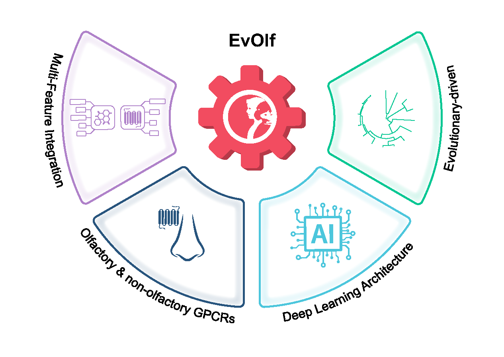

# EvOlf
<div align="center">
</div>
<br>

<!--- BADGES --->
[](https://colab.research.google.com/github/zou-group/TextGrad/blob/main/examples/notebooks/Prompt-Optimization.ipynb)
<!--- Update colab path --->
<!--- ADD Paper when published --->

EvOlf is a cutting-edge deep-learning framework designed to predict ligand-GPCR interactions, integrating odorant and non-odorant GPCRs across 24 species. Using advanced modeling techniques, it enables accurate predictions and GPCR deorphanization. <br><br>
Want to see it in action? We’ve provided a Google Colab notebook so you can easily run predictions on your own data! 🚀
<br>
<br>
👉 [EvOlf Colab Notebook](https://pages.github.com/)
<!--- Update colab path --->

## Get Started
Ready to dive in? First, clone this repository to your chosen location:
```bash
git clone https://github.com/the-ahuja-lab/EvOlf.git
```
Here's a key thing to remember: Your working directory is the folder where you cloned EvOlf, not EvOlf itself! For example, if you clone EvOlf inside a folder called `MyProjects`, then `MyProjects` is your working directory.

---

### 📄 Preparing Your Input Data 

Before you unleash EvOlf’s predictive power, make sure your input data is formatted correctly! Each row should represent a single ligand-receptor interaction and must include:  

- **SMILES** ⌬ – The molecular representation of the ligand.  
- **Receptor Sequence** 🪢 – The amino acid sequence of the GPCR.  

To keep things organized, you can provide your own **unique identifiers** for ligands, receptors, and ligand-receptor pairs, or if you prefer, EvOlf can generate them for you automatically. 
Let’s go through both options! 🚀

---

#### 📝 Simplest Format: No IDs Required!
If manually assigning identifiers sounds like a hassle, you can skip them entirely! Just provide a CSV file with only ligand SMILES and receptor sequences, and EvOlf will automatically generate the necessary IDs for you.

🔹 No IDs Provided Example
| SMILES | Sequence |
|:-----------|:-----------|
|OCC/C=C\CC  | MEPRKNVTDFVLLGFTQNPKEQKVLFVMFLLFYILTMVGNLLIVVTVTVSETLGSPMSFFLAGLTFIDIIYSSSISPRLISDLFFGNNSISFQSFMAQLFIEHLFGGSEVFLLLVMAYDRYVAICKPLHYLVIMRQWVCVLLLVVSWVGGFLQSVFQLSIIYGLPFCGPNVIDHFFCDMYPLLKLACTDTHVIGLLVVANGGLSCTIAFLLLLISYGVILHSLKKLSQKGRQKAHSTCSSHITVVVFFFVPCIFMCARPARTFSIDKSVSVFYTVITPMLNPLIYTLRNSEMTSAMKKL|
|OCC/C=C\CC  | MIPIQLTVFFMIIYVLESLTIIVQSSLIVAVLGREWLQVRRLMPVDMILISLGISRFCLQWASMLNNFCSYFNLNYVLCNLTITWEFFNILTFWLNSLLTVFYCIKVSSFTHHIFLWLRWRILRLFPWILLGSLMITCVTIIPSAIGNYIQIQLLTMEHLPRNSTVTDKLENFHQYQFQAHTVALVIPFILFLASTIFLMASLTKQIQHHSTGHCNPSMKARFTALRSLAVLFIVFTSYFLTILITIIGTLFDKRCWLWVWEAFVYAFILMHSTSLMLSSPTLKRILKGKC|
|CCCC(=O)O  |  MGRGNSTEVTEFHLLGFGVQHEFQHVLFIVLLLIYVTSLIGNIGMILLIKTDSRLQTPMYFFPQHLAFVDICYTSAITPKMLQSFTEENNLITFRGCVIQFLVYATFATSDCYLLAIMAMDCYVAICKPLRYPMIMSQTVYIQLVAGSYIIGSINASVHTGFTFSLSFCKSNKINHFFCDGLPILALSCSNIDINIILDVVFVGFDLMFTELVIIFSYIYIMVTILKMSSTAGRKKSFSTCASHLTAVTIFYGTLSYMYLQPQSNNSQENMKVASIFYGTVIPMLNPLIYSLRNKEGK|
|CCCCCCCC=O  |  MGRGNSTEVTEFHLLGFGVQHEFQHVLFIVLLLIYVTSLIGNIGMILLIKTDSRLQTPMYFFPQHLAFVDICYTSAITPKMLQSFTEENNLITFRGCVIQFLVYATFATSDCYLLAIMAMDCYVAICKPLRYPMIMSQTVYIQLVAGSYIIGSINASVHTGFTFSLSFCKSNKINHFFCDGLPILALSCSNIDINIILDVVFVGFDLMFTELVIIFSYIYIMVTILKMSSTAGRKKSFSTCASHLTAVTIFYGTLSYMYLQPQSNNSQENMKVASIFYGTVIPMLNPLIYSLRNKEGK|
|CC(=O)C(=O)C  |  MVGANHSVVSEFVFLGLTNSWEIRLLLLVFSSMFYMASMMGNSLILLTVTSDPHLHSPMYFLLANLSFIDLGVSSVTSPKMIYDLFRKHEVISFGGCIAQIFFIHVIGGVEMVLLIAMAFDRYVAICKPLQYLTIMSPRMCMFFLVAAWVTGLIHSVVQLVFVVNLPFCGPNVSDSFYCDLPRFIKLACTDSYRLEFMVTANSGFISLGSFFILIISYVVIILTVLKHSSAGLSKALSTLSAHVSVVVLFFGPLIFVYTWPSPSTHLDKFLAIFDAVLTPVLNPIIYTFRN|

When using this format, EvOlf will generate a file called `Input_ID_Information.csv` in the output directory, which contains automatically assigned Ligand IDs, Receptor IDs, and Ligand-Receptor Pair IDs.

---
#### 📝 Provide Unique Identifiers
If you prefer more control over your data, you can provide custom unique IDs for ligands, receptors, and ligand-receptor pairs. This helps keep your dataset structured and makes it easier to track specific interactions.

✅ Good Input Data Example
| ID | Ligand_ID | SMILES | Receptor_ID| Sequence |
|:-----|:---------|:-----------|:---------|:-----------|
|LR1  |L1  |OCC/C=C\CC  |R1  | MEPRKNVTDFVLLGFTQNPKEQKVLFVMFLLFYILTMVGNLLIVVTVTVSETLGSPMSFFLAGLTFIDIIYSSSISPRLISDLFFGNNSISFQSFMAQLFIEHLFGGSEVFLLLVMAYDRYVAICKPLHYLVIMRQWVCVLLLVVSWVGGFLQSVFQLSIIYGLPFCGPNVIDHFFCDMYPLLKLACTDTHVIGLLVVANGGLSCTIAFLLLLISYGVILHSLKKLSQKGRQKAHSTCSSHITVVVFFFVPCIFMCARPARTFSIDKSVSVFYTVITPMLNPLIYTLRNSEMTSAMKKL|
|LR2  |L1  |OCC/C=C\CC  |R2  | MIPIQLTVFFMIIYVLESLTIIVQSSLIVAVLGREWLQVRRLMPVDMILISLGISRFCLQWASMLNNFCSYFNLNYVLCNLTITWEFFNILTFWLNSLLTVFYCIKVSSFTHHIFLWLRWRILRLFPWILLGSLMITCVTIIPSAIGNYIQIQLLTMEHLPRNSTVTDKLENFHQYQFQAHTVALVIPFILFLASTIFLMASLTKQIQHHSTGHCNPSMKARFTALRSLAVLFIVFTSYFLTILITIIGTLFDKRCWLWVWEAFVYAFILMHSTSLMLSSPTLKRILKGKC|
|LR3  |L2  |CCCC(=O)O  |R3  |  MGRGNSTEVTEFHLLGFGVQHEFQHVLFIVLLLIYVTSLIGNIGMILLIKTDSRLQTPMYFFPQHLAFVDICYTSAITPKMLQSFTEENNLITFRGCVIQFLVYATFATSDCYLLAIMAMDCYVAICKPLRYPMIMSQTVYIQLVAGSYIIGSINASVHTGFTFSLSFCKSNKINHFFCDGLPILALSCSNIDINIILDVVFVGFDLMFTELVIIFSYIYIMVTILKMSSTAGRKKSFSTCASHLTAVTIFYGTLSYMYLQPQSNNSQENMKVASIFYGTVIPMLNPLIYSLRNKEGK|
|LR4  |L3  |CCCCCCCC=O  |R3  |  MGRGNSTEVTEFHLLGFGVQHEFQHVLFIVLLLIYVTSLIGNIGMILLIKTDSRLQTPMYFFPQHLAFVDICYTSAITPKMLQSFTEENNLITFRGCVIQFLVYATFATSDCYLLAIMAMDCYVAICKPLRYPMIMSQTVYIQLVAGSYIIGSINASVHTGFTFSLSFCKSNKINHFFCDGLPILALSCSNIDINIILDVVFVGFDLMFTELVIIFSYIYIMVTILKMSSTAGRKKSFSTCASHLTAVTIFYGTLSYMYLQPQSNNSQENMKVASIFYGTVIPMLNPLIYSLRNKEGK|
|LR5  |L4  |CC(=O)C(=O)C  |R4  |  MVGANHSVVSEFVFLGLTNSWEIRLLLLVFSSMFYMASMMGNSLILLTVTSDPHLHSPMYFLLANLSFIDLGVSSVTSPKMIYDLFRKHEVISFGGCIAQIFFIHVIGGVEMVLLIAMAFDRYVAICKPLQYLTIMSPRMCMFFLVAAWVTGLIHSVVQLVFVVNLPFCGPNVSDSFYCDLPRFIKLACTDSYRLEFMVTANSGFISLGSFFILIISYVVIILTVLKHSSAGLSKALSTLSAHVSVVVLFFGPLIFVYTWPSPSTHLDKFLAIFDAVLTPVLNPIIYTFRN|

This is exactly how your data should be structured:

✅ Each unique SMILES has a corresponding unique Ligand ID. <br> 
✅ Each unique receptor sequence has a corresponding unique Receptor ID. <br> 
✅ Each ligand-receptor pair (row) has a unique ID. <br> 

This structure ensures EvOlf correctly maps interactions without confusion or redundancy.

---

#### ❌ Common Mistakes to Avoid <br>
Providing incorrect or inconsistent identifiers can cause errors in prediction. Below is an example of what NOT to do:

Bad Input Data Example
| ID | Ligand_ID | SMILES | Receptor_ID| Sequence |
|:-----|:---------|:-----------|:---------|:-----------|
|LR1  |L1  |OCC/C=C\CC  |R1  | MEPRKNVTDFVLLGFTQNPKEQKVLFVMFLLFYILTMVGNLLIVVTVTVSETLGSPMSFFLAGLTFIDIIYSSSISPRLISDLFFGNNSISFQSFMAQLFIEHLFGGSEVFLLLVMAYDRYVAICKPLHYLVIMRQWVCVLLLVVSWVGGFLQSVFQLSIIYGLPFCGPNVIDHFFCDMYPLLKLACTDTHVIGLLVVANGGLSCTIAFLLLLISYGVILHSLKKLSQKGRQKAHSTCSSHITVVVFFFVPCIFMCARPARTFSIDKSVSVFYTVITPMLNPLIYTLRNSEMTSAMKKL|
|LR2  |L2  |OCC/C=C\CC  |R1  | MIPIQLTVFFMIIYVLESLTIIVQSSLIVAVLGREWLQVRRLMPVDMILISLGISRFCLQWASMLNNFCSYFNLNYVLCNLTITWEFFNILTFWLNSLLTVFYCIKVSSFTHHIFLWLRWRILRLFPWILLGSLMITCVTIIPSAIGNYIQIQLLTMEHLPRNSTVTDKLENFHQYQFQAHTVALVIPFILFLASTIFLMASLTKQIQHHSTGHCNPSMKARFTALRSLAVLFIVFTSYFLTILITIIGTLFDKRCWLWVWEAFVYAFILMHSTSLMLSSPTLKRILKGKC|
|LR3  |L3  |CCCC(=O)O  |R2  |  MGRGNSTEVTEFHLLGFGVQHEFQHVLFIVLLLIYVTSLIGNIGMILLIKTDSRLQTPMYFFPQHLAFVDICYTSAITPKMLQSFTEENNLITFRGCVIQFLVYATFATSDCYLLAIMAMDCYVAICKPLRYPMIMSQTVYIQLVAGSYIIGSINASVHTGFTFSLSFCKSNKINHFFCDGLPILALSCSNIDINIILDVVFVGFDLMFTELVIIFSYIYIMVTILKMSSTAGRKKSFSTCASHLTAVTIFYGTLSYMYLQPQSNNSQENMKVASIFYGTVIPMLNPLIYSLRNKEGK|
|LR4  |L3  |CCCCCCCC=O  |R3  |  MGRGNSTEVTEFHLLGFGVQHEFQHVLFIVLLLIYVTSLIGNIGMILLIKTDSRLQTPMYFFPQHLAFVDICYTSAITPKMLQSFTEENNLITFRGCVIQFLVYATFATSDCYLLAIMAMDCYVAICKPLRYPMIMSQTVYIQLVAGSYIIGSINASVHTGFTFSLSFCKSNKINHFFCDGLPILALSCSNIDINIILDVVFVGFDLMFTELVIIFSYIYIMVTILKMSSTAGRKKSFSTCASHLTAVTIFYGTLSYMYLQPQSNNSQENMKVASIFYGTVIPMLNPLIYSLRNKEGK|
|LR4  |L4  |CC(=O)C(=O)C  |R4  |  MVGANHSVVSEFVFLGLTNSWEIRLLLLVFSSMFYMASMMGNSLILLTVTSDPHLHSPMYFLLANLSFIDLGVSSVTSPKMIYDLFRKHEVISFGGCIAQIFFIHVIGGVEMVLLIAMAFDRYVAICKPLQYLTIMSPRMCMFFLVAAWVTGLIHSVVQLVFVVNLPFCGPNVSDSFYCDLPRFIKLACTDSYRLEFMVTANSGFISLGSFFILIISYVVIILTVLKHSSAGLSKALSTLSAHVSVVVLFFGPLIFVYTWPSPSTHLDKFLAIFDAVLTPVLNPIIYTFRN|

🚨 **What's Wrong Here?** <br>
- **Repeated Ligand IDs for Different SMILES** → "L3" is assigned to two different SMILES structures. Each ligand should have one unique ID. <br>
- **Different Ligand IDs for the Same SMILES** → "L1" and "L2" both have the same SMILES (OCC/C=C\CC). A single ligand should always have a consistent Ligand_ID. <br> 
- **Repeated Receptor IDs for Different Sequences** → "R1" is assigned to two different receptor sequences. Each receptor sequence should have one unique ID. <br> 
- **Different Receptor IDs for the Same Sequence** → "R2" and "R3" have the exact same receptor sequence, yet they are assigned different Receptor_IDs. Each unique receptor sequence should have one consistent Receptor_ID to avoid confusion. <br>
- **Duplicate Ligand-Receptor Pair IDs** → "LR4" appears twice. Every row should have a unique ID for proper tracking. <br> 

Data like this will break EvOlf’s ability to correctly associate ligands and receptors!

---

🛠 **Let EvOlf Handle the IDs!** <br>
If you don't want to manually assign identifiers. Just provide a CSV with ligand SMILES and receptor sequences, and EvOlf will take care of the rest. The assigned IDs will be available in the `Input_ID_Information.csv` file in the output directory.

---

#### 🎯 Key Takeaways
✔ Option 1: Provide only SMILES and Receptor Sequences, and let EvOlf handle the rest. <br> 
✔ Option 2: Provide custom unique IDs for ligands, receptors, and ligand-receptor pairs for better tracking. <br> 
✔ Make sure all IDs are unique to avoid errors in predictions. <br> 
✔ If you skip IDs, check `Input_ID_Information.csv` for automatically assigned identifiers. <br> 

Now you’re all set 


## 📂 Output Files 
After running the Colab notebook, EvOlf generates several output files. Each one provides valuable insights into your data and predictions. Whether you're looking for interaction predictions or just need embeddings for your own model, EvOlf provides both. Here’s what each file means:

1️⃣**Input_ID_Information.csv** <br>
📌 **What it contains**: <br>
Unique IDs assigned to each ligand, receptor, and ligand-receptor pair. <br> 
Information on any pairs that were not processed. <br> 
💡 **Why it matters***: This file helps track how your inputs were mapped and ensures all IDs are assigned correctly. <br>

✅ Example of `Input_ID_Information.csv`:
|SrNum|IDs|Ligand_ID|SMILES|Receptor_ID|Sequence|ProcessingStatus|
|:----|:-------|:---------|:----------|:---------|:----------|:-------|
|1|LR1|L1|OCC/C=C\CC|R1|MEPRKNVTDFVLLGFTQN...|Processed|
|2|LR2|L1|OCC/C=C\CC|R2|MIPIQLTVFFMIIYVLES...|Processed|
|3|LR3|L2|CCCC(=O)O|R3|MGRGNSTEVTEFHLLGFGV...|Processed|
|4|LR4|L3|CCCCCCCC=O|R3|MGRGNSTEVTEFHLLGFG...|Processed|
|5|LR5|L4|CC(=O)C(=O)C|R4|MVGANHSVVSEFVFLG...|Processed|

2️⃣**Ligand_Embeddings.csv** <br>
📌 **What it contains**: <br>
Numerical vector representations (embeddings) of all ligands generated by EvOlf. <br>
💡 **Why it matters**: Want to train your own model or analyze ligand properties? These embeddings provide a machine-readable format that captures key molecular features.

3️⃣**Receptor_Embeddings.csv** <br>
📌 **What it contains**: <br>
Embeddings for all receptors, similar to ligand embeddings but for receptor sequences. <br>
💡 **Why it matters**: Useful for training models or clustering receptors.

4️⃣ LR_Pair_Embeddings.csv <br>
📌 **What it contains**: <br>
Combined ligand-receptor pair embeddings. <br>
💡 **Why it matters**: These embeddings power EvOlf’s interaction predictions, but you can also use them for custom machine-learning applications!

5️⃣ Prediction_Output.csv <br>
📌 **What it contains**: <br>
The final predictions made by EvOlf, including interaction labels (0 or 1) and confidence scores. <br>
💡 **Why it matters**: This file tells you which ligand-receptor pairs are predicted to interact and with what level of confidence.

✅ Example of `Prediction_Output.csv`:
|ID|Predicted Label|P1|
|:-------|:---------|:----------|
|LR1|0|0.000226742238737642|
|LR2|0|0.000139558469527401|
|LR3|0|0.00170087465085089|
|LR4|0|0.000176260960870422|
|LR5|0|0.12915557622909546|

